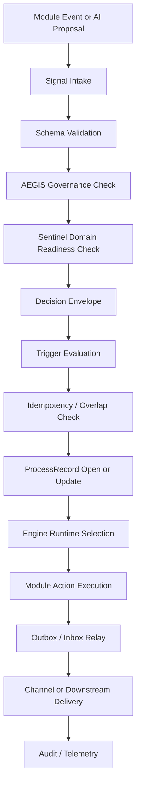
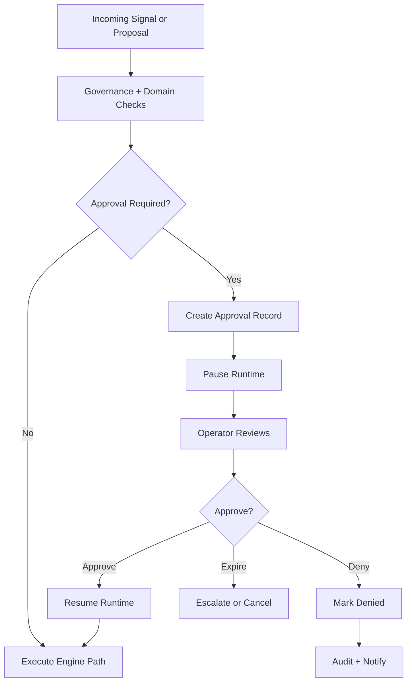
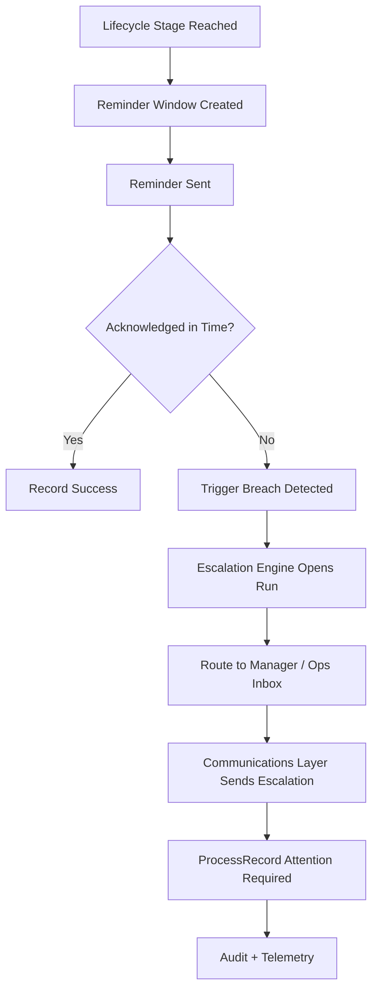
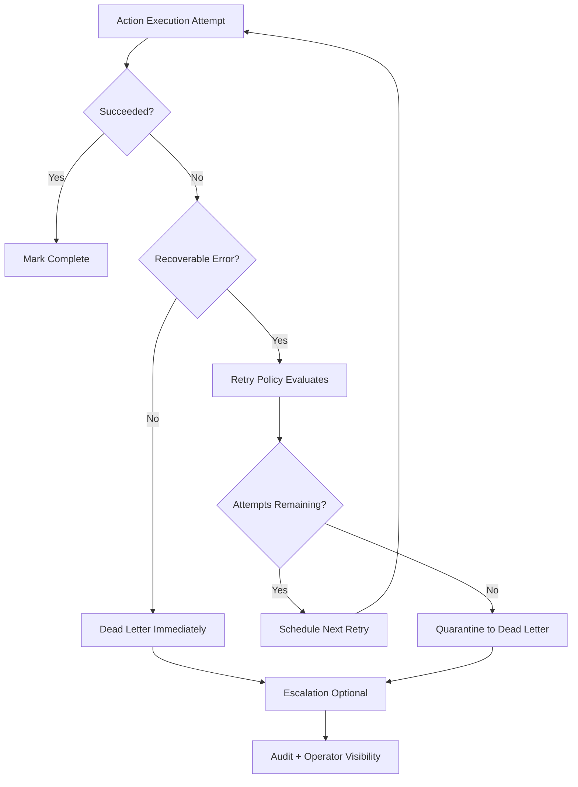
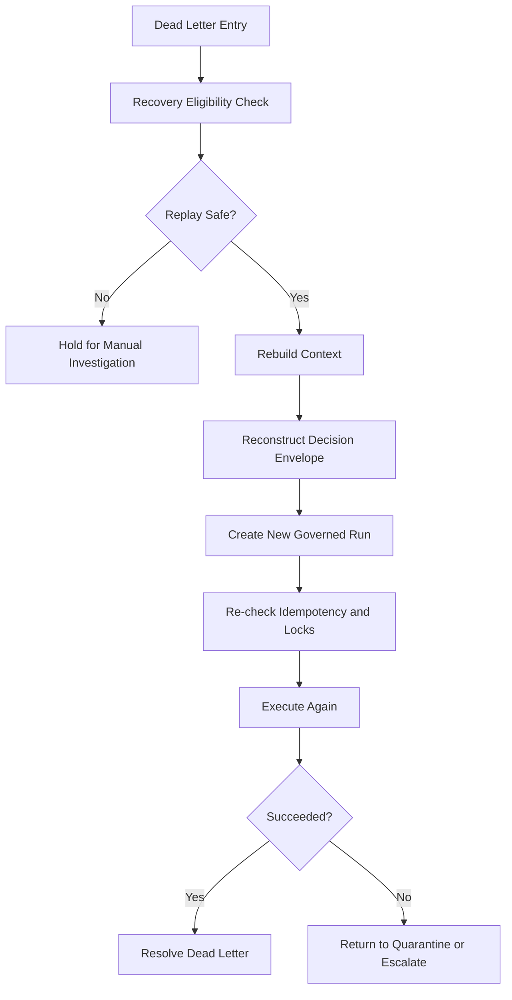
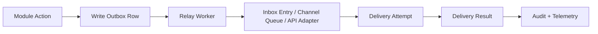
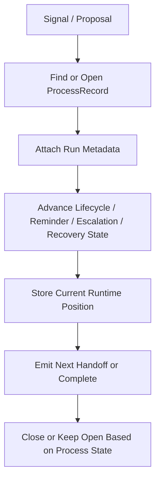
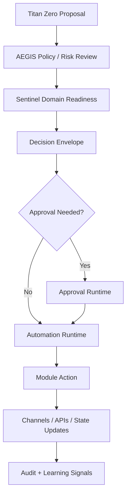

# Titan Zero Documentation

Layer: Automation
Scope: Mermaid diagrams for core automation runtime flows, approval pauses, retries, dead letters, replay, and cross-engine handoff
Status: Draft v1
Depends On: automation-engines.md, lifecycle-engine.md, approval-runtime.md, retry-strategy.md, dead-letter-queues.md, process-record-integration.md, decision-envelopes.md, outbox-inbox-relays.md, titan-governance-flow-mapping.md
Consumed By: Developers, operators, support teams, implementation agents, onboarding docs, runbook authors
Owner: Agent 06 — Automation
Last Updated: 2026-04-15

---

## 1. Purpose

Provide reusable Mermaid diagrams that visualize the automation runtime in a consistent way.

## 2. Why it exists

The automation docs explain responsibilities in detail, but diagrams are still needed for:

- fast onboarding
- architecture reviews
- operator training
- support handoffs
- GitHub issue prompts
- implementation validation

Without diagrams:

- engine boundaries blur
- approval pauses are misread as synchronous UI actions
- retries and dead letters get hidden inside queue folklore
- ProcessRecord usage is forgotten
- AI governance handoffs look magical instead of explicit

## 3. Diagram rules

All automation diagrams should follow these rules:

- show runtime pauses explicitly
- show governance before execution
- show ProcessRecord writes where state becomes durable
- show idempotency/lock checks before side effects
- show dead-letter as a controlled terminal branch
- show replay as a new governed run, not a raw requeue
- distinguish proposal, approval, execution, and delivery

## 4. Diagram A: governed signal-to-action flow

### What it shows

- no action executes before governance
- decision envelopes are first-class runtime inputs
- ProcessRecord becomes the durable state spine
- delivery is downstream from action execution, not the action itself

## 5. Diagram B: approval-sensitive runtime pause

### What it shows

- approval is a durable state, not a modal dialog
- pause/resume is runtime behavior
- deny/expire are explicit terminal branches

## 6. Diagram C: reminder to escalation handoff

## 7. Diagram D: retry and dead-letter path

### What it shows

- retry policy is not the same thing as queue retry defaults
- dead letter is explicit quarantine after policy exhaustion
- operators should see the failure state clearly

## 8. Diagram E: recovery and replay flow

## 9. Diagram F: outbox/inbox relay boundary

### What it shows

- action execution and message delivery are separated
- relay workers move durable payloads across boundaries
- delivery results must return to telemetry and audit

## 10. Diagram G: ProcessRecord-centered automation

## 11. Diagram H: Titan Zero to governed automation

## 12. Recommended usage

Use these diagrams in:

- module docs
- GitHub implementation prompts
- ops runbooks
- support/debug docs
- onboarding packs
- architecture review notes

## 13. Implementation notes

When converting diagrams to real code, verify that:

- the named tables and records actually exist
- approval rows are durable and resumable
- retry policy is configurable per engine family
- dead-letter payloads keep causation metadata
- ProcessRecord is updated by engine transitions, not only by modules
- delivery telemetry returns from channels to the runtime layer

## 14. Related docs

- `automation-engines.md`
- `approval-runtime.md`
- `retry-strategy.md`
- `dead-letter-queues.md`
- `process-record-integration.md`
- `decision-envelopes.md`
- `outbox-inbox-relays.md`
- `worked-engine-examples.md`
- `titan-governance-flow-mapping.md`
