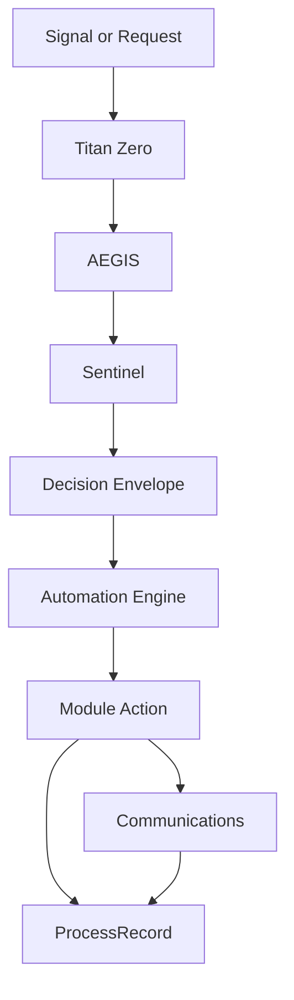

# Titan Zero Documentation

Layer: Automation
Scope: Mapping automation runtime flow into Titan Zero, AEGIS, Sentinel, and module execution boundaries
Status: Draft v1
Depends On: automation-engines.md, decision-envelopes.md, approval-runtime.md, process-record-integration.md, signals, governance doctrine
Consumed By: Titan Zero, AEGIS, Sentinels, workflow layer, module developers, support tooling
Owner: Agent 06 — Automation
Last Updated: 2026-04-15

---

## 1. Purpose

Define the end-to-end handoff path from AI reasoning and governance through automation runtime into module execution, channel delivery, and audit replay.

## 2. Why it exists

The automation layer only makes sense if its upstream and downstream boundaries are clear.

The most common failure in multi-layer platforms is confusion about who owns the decision:

- AI assumes it executed work when it only proposed it
- governance is bypassed because approval points are unclear
- Sentinels are treated like generic validators instead of domain readiness gates
- modules hide execution logic inside UI actions
- support teams cannot explain why a runtime action happened

This document fixes that by making the flow explicit.

## 3. High-level rule

Titan Zero proposes. AEGIS governs. Sentinels approve domain readiness. Automation coordinates runtime. Modules perform business actions. Channels deliver side effects.

## 4. Canonical flow

1. **Signal or request arrives**
2. **Titan Zero** forms or enriches a decision context
3. **AEGIS** applies policy, authority, and cross-domain checks
4. **Sentinel** checks domain-specific readiness
5. **Decision envelope** is emitted to runtime
6. **Automation engine** accepts, delays, retries, escalates, or pauses the work
7. **Module action/service/job** performs the business mutation
8. **Communications** deliver outbound side effects if required
9. **ProcessRecord + audit logs** persist the runtime chain
10. **Replay/recovery** can reconstruct or re-drive later if needed

## 5. Layer-by-layer ownership

### Titan Zero

Owns:

- user-facing reasoning
- intent interpretation
- proposal generation
- tool selection suggestions
- response synthesis

Does not own:

- final policy authority
- domain readiness approval
- guaranteed execution timing
- direct mutation authority outside approved paths

### AEGIS

Owns:

- policy enforcement
- cross-domain consistency
- authority and permission checks
- automation safety modes
- mandatory approval gating rules

Does not own:

- domain-specific operational state transitions
- low-level queue timing
- channel template rendering

### Sentinel

Owns:

- domain readiness checks
- dependency satisfaction
- conflict detection inside a domain
- final domain approval before execution

Does not own:

- cross-domain policy law
- AI reasoning
- user-facing copy generation

### Automation runtime

Owns:

- delayed execution
- reminders
- escalations
- retries
- quarantine/dead-letter handling
- approval pause/resume handling
- recovery and re-drive orchestration

Does not own:

- business truth of the module entity
- UI-specific presentation logic
- authority law definition

### Module action layer

Owns:

- actual create/update/cancel/complete business mutation
- durable write into module entities
- domain events emitted after mutation

Does not own:

- global governance
- queue policy
- runtime replay policy

## 6. Decision envelope handoff

The clean boundary between governance and automation is the **decision envelope**.

A practical envelope should carry:

- tenant boundary
- actor and authority context
- source signal/request
- selected action or requested transition
- approval state
- risk summary
- idempotency key
- expiry or timing window
- downstream engine hint
- audit pointer

Automation should not infer this from raw request state after the fact.

## 7. Example paths

### 7.1 Booking reminder path

- visit scheduled
- lifecycle stage moves to `scheduled`
- Titan Zero may summarize the context but does not send the message directly
- AEGIS confirms reminders are allowed for this tenant and channel
- Sentinel confirms booking is valid and not cancelled
- reminder engine schedules runtime work
- communications layer delivers reminder through approved channels
- ProcessRecord records sent, failed, or retried outcomes

### 7.2 Reschedule request path

- customer asks to reschedule
- Titan Zero interprets intent and suggests a reschedule flow
- AEGIS marks the action approval-sensitive
- Sentinel checks domain readiness and current booking state
- approval runtime pauses work at `waiting_approval`
- operator or policy decision resumes the record
- lifecycle engine transitions the booking if approved
- module action performs the actual reschedule mutation

### 7.3 No-access escalation path

- worker reports no access on site
- Titan Zero classifies the report as an operational exception
- AEGIS verifies escalation rules and communication policy
- Sentinel confirms the visit is active and unresolved
- escalation engine opens a runtime branch
- communications and operations surfaces notify the right parties
- recovery engine may schedule a follow-up or rebooking path

## 8. ProcessRecord relationship

Each major handoff should attach to the same ProcessRecord chain or a linked child chain.

This makes it possible to answer:

- who proposed the work
- who approved it
- which engine accepted it
- which mutation executed
- which side effects emitted
- why a retry, escalation, or quarantine occurred

## 9. Where approvals belong

Approval should sit between governance/domain readiness and runtime mutation.

That means:

- before module mutation
- before outbound side effects if policy requires it
- before replay of sensitive actions

Approval should not be bolted into controller code or hidden inside a panel callback.

## 10. Error ownership map

### Titan Zero errors

- intent ambiguity
- tool selection mismatch
- insufficient context assembly

### AEGIS errors

- permission denied
- policy conflict
- authority violation
- risk threshold exceeded

### Sentinel errors

- readiness failure
- lifecycle conflict
- missing dependency
- domain lock or concurrency conflict

### Automation errors

- retry exhaustion
- timing window miss
- duplicate suppression hit
- dead-letter quarantine

### Module errors

- validation failure at action boundary
- persistence failure
- domain invariant breach

This separation keeps support and observability useful.

## 11. Diagram pattern

## 12. Operator-facing interpretation

For operators, the flow should surface as:

- proposed
- governed
- approved or denied
- scheduled or paused
- executed or retried
- completed, quarantined, or recovered

Do not force operators to think in raw queue or event terms when the state can be translated safely.

## 13. Audit and replay principle

Replay must respect the same ownership chain as live execution.

A replay is not a shortcut around governance. It should:

- reconstruct the prior envelope
- re-run policy and readiness checks where required
- preserve idempotency and duplicate guards
- attach replay metadata to the ProcessRecord

## 14. Summary

The Titan governance flow is strongest when each layer has a clear and limited job. Titan Zero reasons, AEGIS governs, Sentinels approve domain readiness, automation coordinates runtime behavior, modules mutate business truth, and channels deliver side effects. Keeping those boundaries explicit prevents drift, duplicate logic, and unsafe execution.
